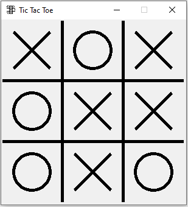
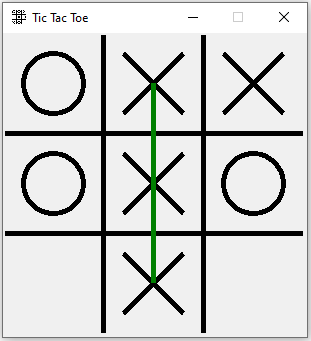
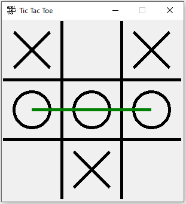

# Tic Tac Toe - Tkinter

The tic tac toe game made using Tkinter

## UI explanation:

Tic Tac Toe is the root widget, over which a canvas is created once the app is run. Four black cross lines are drawn on the canvas. Now, **X** or **O** is drawn alternatively on the boxes for every click at particular area in the canvas, and if there's a winner, a green line is drawn on the matching boxes, else, it's **draw**. So, clicking again on the screen, kills the canvas and recreates the instance, by which we get a new game everytime, unless the app is closed.

## Code

Initially root is created with title, size, and maximize_disable

### New Game Method

This method is called before the mainloop method to create new canvas instance, draw 4 cross lines on the canvas and **bind** it to a click event, to fetch the co-ordinates of the position where the 1st or the left mouse button is clicked, from which the **coord** method is called.

### Coord Method

Takes in mouse events, and converts it into four co-ordinates necessary to draw an **x or O** on the canvas, and stores the places where already and X or O exists to avoid repetition. After 5 clicks, check method is called (because, for a fastest win scenario, atleast 5 clicks are necessary,for example 3 X clicks and 2 O clicks

### Draw Shape Method

Gets the co-ordinates from **coord** method and draws X on the canvas using two lines and draws O on the canvas using a circle

### Check Method

A Global win variable consists of winning scenarios as a list of lists, using which this method checks if there's a winner or not. If a winner is found, call the drawWinner method, to draw the green winning line. If draw, it sends a **None** as a parameter in place of co-ordinates and **1** for draw, so that no line is drawn.

### Draw Winner Method

This method, draws the green line with co-ordinates passed from the check method. If **1** is passed to the **draw** parameter, then the canvas is bound to kill method over left mouse event.

### The Kill Method

This method kills the canvas and calls the **NewGame** method to keep this game in a loop until the game is physically closed.

## How to run it:
1. Download the **tictactoe.py** file
2. Open terminal/cmd and cd to the downloaded directory
3. Enter command **python tictactoe.py** or **python3 tictactoe.py** based on the configuration

## Requirements:
1. Python 3.7
2. Tkinter

# Thank You
